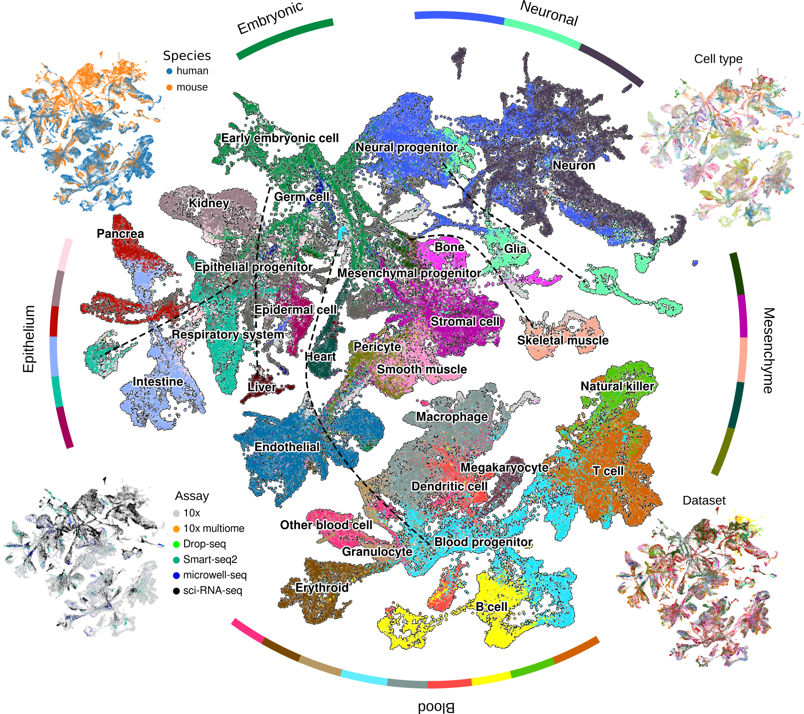

# Single Cell Manifold Generator (SCMG)

**SCMG** is a suite of deep learning models designed to interpret, generate, and predict the molecular basis of cell states and their transitions.

## Key Features

- **Global Manifold Construction**  
  Build a well-integrated reference manifold of single-cell transcriptional states that captures cell-state relationships and gene expression patterns. The global gene expression patterns can be visualized [here](https://xingjiepan.github.io/SCMG/).

- **Zero-Shot Dataset Integration**  
  Integrate new scRNA-seq datasets without the need for model retraining.

- **Zero-Shot Cell Projection**  
  Project single-cells onto the global manifold for downstream analysis and comparison.

- **Cell State Trajectory Generation**  
  Generate continuous trajectories to model transitions between cell states.

- **Causal Gene Prediction**  
  Identify candidate causal genes driving transitions between specific cell states.
  
- **Universal Decomposition of Perturbation Effects**  
  Decompose perturbation effects into universal principal axes of cell state transition and perturbation classes. 

- **Few-shot Prediction of Perturbation Effects**  
  Predict perturbation-induced cell state transition by few-shot learning.

## Installation guide
The SCMG package can be installed from pip. The installation takes one to a few minutes. The detailed instructions for installation are available [here](https://scmg.readthedocs.io/en/latest/installation.html)

## System requirements
### OS Requirements
This package is compatible with major operating systems that support PyTorch, including Linux, macOS, and Windows.
### Package dependencies
The package dependencies are specified in [pyproject.toml](https://github.com/xingjiepan/SCMG/blob/main/pyproject.toml)
### Tested version
The current version of the tested release is scmg1.0
## Demo and instructions for use
Tutorials for the main functions of SCMG are available [here](https://scmg.readthedocs.io/en/latest/tutorials/index.html). The running time for individual tutorials ranges from a few minutes (with GPU) to within one hour (with CPU only).

The scripts to reproduce the results reported in the manuscript are available [here](https://github.com/xingjiepan/SCMG_scripts).
